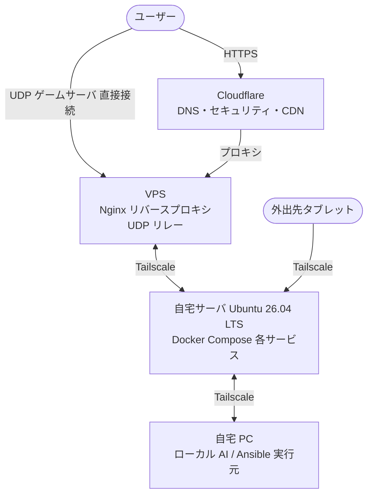

# ポートフォリオ

## このプロジェクトについて

Ansible・Docker Compose を使った自宅サーバの構成管理リポジトリです。
以下をポートフォリオとして公開しています。

- **Ansible による環境構築の自動化**：OS 設定・Docker 導入・サービス起動まで Playbook で管理
- **監視ダッシュボード**：Prometheus + Grafana でサーバ・サービスのメトリクスを可視化
- **ゲームサーバの自動構築**：Factorio・Windrose（UE5）の専用サーバをコンテナで運用
- **手順書**：手順通りに実行すれば同じ環境を再現できる設計

---

## 技術スタック

| カテゴリ | 技術 |
|---|---|
| 構成管理 | Ansible |
| コンテナ | Docker・Docker Compose |
| ネットワーク | Tailscale |
| DNS・セキュリティ | Cloudflare |
| 監視 | Prometheus・Grafana・Node Exporter |
| リバースプロキシ | Nginx |
| SSL | Cloudflare Origin Certificate |
| OS | Ubuntu Server 26.04 LTS |
| バージョン管理 | Git・GitHub |

---

## 構成図

> HTTP/HTTPS は Cloudflare のプロキシ経由で VPS に到達するため、自宅サーバの IP はユーザーに公開されません。
> ゲームサーバ（UDP）は VPS 経由でリレーし、自宅 IP を隠蔽します。
> 外出先タブレットは Tailscale 経由で自宅サーバに直接アクセスできます。

---

## 技術選定の理由

### Tailscale

VPN として WireGuard も検討しましたが、以下の理由で Tailscale を選択しました。

- セットアップが簡単（認証キー1つでノードが参加できる）
- ノード間の Tailscale IP が固定されるため、inventory.ini の管理が楽
- タブレット・スマートフォンにも対応しており、外出先からの操作が容易
- WireGuard ベースのため通信は暗号化済み

### Docker Compose（サービスごとにファイルを分割）

全サービスを1ファイルにまとめる方法もありますが、以下の理由でサービスごとに分割しています。

- 使いたいサービスだけを選んで起動できる
- サービスごとに独立しているため、1つの設定変更が他に影響しない
- 将来サービスを追加・削除しやすい
- 別サーバへの切り離しが容易（将来対応）

### Ansible

- エージェントレス（対象サーバに特別なソフトが不要、SSH が通れば動く）
- YAML で設定を記述するため、何をしているかが読みやすい
- 冪等性があるため、復旧時に安心して何度でも実行できる
- 実行元を自宅 PC に統一することで、サーバ側の依存を最小化

### Cloudflare + Origin Certificate

- DNS プロバイダとして利用し、プロキシを有効化することで自宅サーバの IP を隠蔽
- DDoS 対策・WAF などのセキュリティ機能を無償で利用可能
- Origin Certificate（有効期限 15 年）を使用することで証明書の自動更新運用が不要
- Cloudflare とオリジンサーバ間は End-to-End 暗号化（Full Strict モード）

### VPS をリバースプロキシ専用にした理由

- 自宅の IP アドレスを直接公開しないため、セキュリティリスクを軽減できる
- Nginx 設定をサービス側に寄せてあるため、将来 Cloudflare Tunnel に移行しやすい
- UDP ゲームサーバはどの方式でも VPS が必要なため、役割を一元化

### UFW ロックダウン設計

`02_tailscale` 完了後は SSH を含む全ポートを Tailscale 経由のみに制限しています。
Tailscale の認証を突破しない限りサーバに触れない状態になります。
個人用途のため、運用のシンプルさとセキュリティのバランスとしてこの設計が適切と判断しました。

---

## 技術的な工夫・解決した問題

### Windrose（UE5）専用サーバの Linux コンテナ化

Windrose は Windows 向け Unreal Engine 5 製のゲームで、公式に Linux 版サーババイナリが提供されていません。
以下の方法で Linux Docker コンテナ上での動作を実現しました。

**課題と解決策：**

| 課題 | 解決策 |
|---|---|
| Wine の apt インストールが Dockerfile の `&&` チェーン中でバックグラウンド化されインストール未完了のままレイヤーが確定する | RUN コマンドを分割し、Wine インストールと wineboot 初期化を別レイヤーに分ける |
| `WindroseServer.exe`（ランチャー）が Wine 上で子プロセスを起動できず終了する | 実際のゲームバイナリ `R5/Binaries/Win64/WindroseServer-Win64-Shipping.exe` を直接指定 |
| Wine が GUI ウィンドウを要求し `-nullrhi` 指定でも起動しない | Xvfb で仮想ディスプレイを用意し `DISPLAY=:1` を設定 |
| Mono・Gecko の初期化に時間がかかりタイムアウトする | `WINEDLLOVERRIDES="mscoree,mshtml="` で無効化 |

**結果：** Steam の専用サーババイナリ（App ID: 4129620）をそのままコンテナで動作させることに成功。
招待コード方式（P2P/ICE）のためポート開放不要で、IP 隠蔽が必要な場合は VPS 経由の直接接続モードに切り替え可能。

### Factorio 1.1 と 2.0（Space Age DLC）の分離

`factoriotools/factorio:stable` タグは Factorio 2.0（Space Age DLC 必須）を指します。
DLC を持たない全プレイヤーが参加できるサーバとするため、`1.1` タグを明示的に使用しています。

### Nginx stream モジュールによる UDP リレーの自動化

HTTP リバースプロキシ（Layer 7）では UDP を扱えないため、Nginx の stream モジュール（Layer 4）を使用しています。
Ansible で `relay_factorio: true` / `relay_windrose: true` の変数を設定するだけで、
UFW ポート開放・`libnginx-mod-stream` のインストール・設定ファイル配置まで自動化しています。

---

## 今後の予定

### Cloudflare Tunnel への移行

HTTP/HTTPS サービスを Cloudflare Tunnel に移行し、VPS を経由しない構成を検討しています。
UDP ゲームサーバは引き続き VPS 経由とします。

### サービスの追加予定

| サービス | 用途 |
|---|---|
| Bluesky PDS | 分散型 SNS（AT Protocol） |
| PeerTube | 動画配信 |

### 将来対応

- サービスの別サーバへの切り離し手順
- バックアップからの自動復旧手順
- 複数サーバ構成時の監視対応（prometheus.yml のスクレイプ対象を追加）
