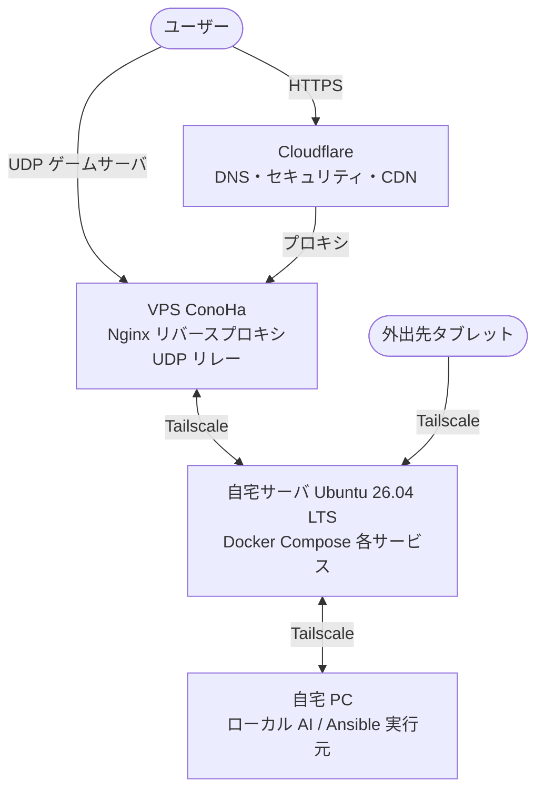

# ポートフォリオ

## このプロジェクトについて

Ansible・Docker Compose を使った自宅サーバの構成管理リポジトリです。
以下をポートフォリオとして公開しています。

- **Ansible による環境構築の自動化**：OS 設定・Docker 導入・サービス起動まで Playbook で管理
- **監視ダッシュボード**：Prometheus + Grafana でサーバ・サービスのメトリクスを可視化
- **手順書**：手順通りに実行すれば同じ環境を再現できる設計

---

## 技術スタック

| カテゴリ | 技術 |
|---|---|
| 構成管理 | Ansible |
| コンテナ | Docker・Docker Compose |
| ネットワーク | Tailscale |
| DNS・セキュリティ | Cloudflare |
| 監視 | Prometheus・Grafana・Node Exporter |
| リバースプロキシ | Nginx |
| SSL | Let's Encrypt（Certbot） |
| OS | Ubuntu Server 26.04 LTS |
| バージョン管理 | Git・GitHub |

---

## 構成図

> HTTP/HTTPS は Cloudflare のプロキシ経由で VPS に到達するため、VPS の IP はユーザーに公開されません。
> 外出先タブレットは Tailscale 経由で自宅サーバに直接アクセスできます。

---

## 技術選定の理由

### Tailscale

VPN として WireGuard も検討しましたが、以下の理由で Tailscale を選択しました。

- セットアップが簡単（認証キー1つでノードが参加できる）
- ノード間の Tailscale IP が固定されるため、inventory.ini の管理が楽
- タブレット・スマートフォンにも対応しており、外出先からの操作が容易
- WireGuard ベースのため通信は暗号化済み

### Docker Compose（サービスごとにファイルを分割）

全サービスを1ファイルにまとめる方法もありますが、以下の理由でサービスごとに分割しています。

- 使いたいサービスだけを選んで起動できる
- サービスごとに独立しているため、1つの設定変更が他に影響しない
- 将来サービスを追加・削除しやすい
- 別サーバへの切り離しが容易（将来対応）

### Ansible

- エージェントレス（対象サーバに特別なソフトが不要、SSH が通れば動く）
- YAML で設定を記述するため、何をしているかが読みやすい
- 冪等性があるため、復旧時に安心して何度でも実行できる
- 実行元を自宅 PC に統一することで、サーバ側の依存を最小化

### Cloudflare

- DNS プロバイダとして利用し、プロキシを有効化することで VPS の IP を隠蔽
- DDoS 対策・WAF などのセキュリティ機能を無償で利用可能
- CDN としてキャッシュを活用し、自宅サーバへのリクエストを削減

### VPS をリバースプロキシ専用にした理由

- 自宅の IP アドレスを直接公開しないため、セキュリティリスクを軽減できる
- Nginx 設定をサービス側に寄せてあるため、将来 Cloudflare Tunnel に移行しやすい
- UDP ゲームサーバはどの方式でも VPS が必要なため、役割を一元化

### UFW ロックダウン設計

`02_tailscale` 完了後は SSH を含む全ポートを Tailscale 経由のみに制限しています。
Tailscale の認証を突破しない限りサーバに触れない状態になります。
個人用途のため、運用のシンプルさとセキュリティのバランスとしてこの設計が適切と判断しました。

---

## 今後の予定

### Cloudflare Tunnel への移行

HTTP/HTTPS サービスを Cloudflare Tunnel に移行し、VPS を経由しない構成を検討しています。
UDP ゲームサーバは引き続き VPS 経由とします。

### 複数 DNS プロバイダ

- プライマリ／セカンダリに異なる DNS プロバイダを設定し、障害時の可用性を確保
- プロバイダごとの遅延・管理画面の使い勝手・機能の違いを検証
- 複数ドメインの取得・ドメイン移管・変更も検討中

### 複数 VPS（踏み台）

- 異なるプロバイダの VPS を並行運用し、1台が落ちても継続稼働できる構成
- プロバイダごとのネットワーク品質・遅延・使い勝手の違いを検証
- 将来的にサービスごとに VPS を分離する構成も視野に

### サービスの追加予定

| サービス | 用途 |
|---|---|
| Bluesky PDS | 分散型 SNS（AT Protocol） |
| PeerTube | 動画配信 |
| River | フィードリーダー |
| Bluecast | （用途検討中） |

### 将来対応

- サービスの別サーバへの切り離し手順
- バックアップからの自動復旧手順
- 複数サーバ構成時の監視対応（prometheus.yml のスクレイプ対象を追加）
